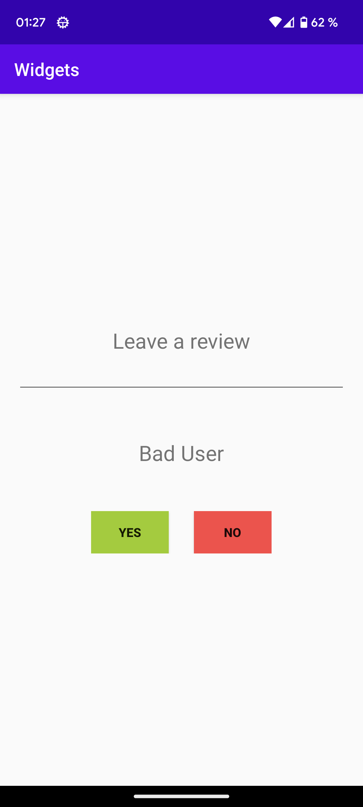

# Rapport

Jag använder mig av en LinearLayout med vertikal orientation, jag har sedan använt mig av ytterligare en LinearLayout med horisontell orientation för att lägga två knappar bredvid varandra.

```
<?xml version="1.0" encoding="utf-8"?>
<LinearLayout xmlns:android="http://schemas.android.com/apk/res/android"
    xmlns:app="http://schemas.android.com/apk/res-auto"
    xmlns:tools="http://schemas.android.com/tools"
    android:layout_width="match_parent"
    android:layout_height="match_parent"
    android:gravity="center_horizontal|center_vertical"
    android:orientation="vertical"
    tools:context=".MainActivity">
    
    <LinearLayout
        android:layout_width="wrap_content"
        android:layout_height="wrap_content"
        android:layout_gravity="center"
        android:orientation="horizontal">

        <Button
          ...
         />

        <Button
          ...
         />
    </LinearLayout>
</LinearLayout>
```

Jag har även lagt till en EditText widget samt två TextViews
```
    <TextView
        android:layout_width="wrap_content"
        android:layout_height="wrap_content"
        android:text="Leave a review"
        android:textSize="24sp"
        ...
        />

    <EditText
        android:id="@+id/reviewBox"
        android:layout_width="match_parent"
        android:layout_height="wrap_content"
        ...
        />

    <TextView
        android:id="@+id/appText"
        android:layout_width="wrap_content"
        android:layout_height="wrap_content"
        android:text="Is this a good app?"
        ...
        />
```

För att ge knapparna funktionalitet har jag implementerat en OnClickListener som ändrar texten i appText TextViewn. Se bild 1 och bild 2 för resultat.
```
        final Button yesBtn = findViewById(R.id.yesBtn);
        final Button noBtn = findViewById(R.id.noBtn);
        final TextView appText = findViewById(R.id.appText);
        yesBtn.setOnClickListener(new View.OnClickListener() {
            @Override
            public void onClick(View view) {
                appText.setText("Good User");
            }
        });


        noBtn.setOnClickListener(new View.OnClickListener() {
            @Override
            public void onClick(View view) {
                appText.setText("Bad User");
            }
        });
```
Bild 1:


Bild 2:


